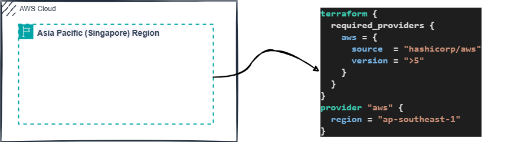

# AWS Medical Examination Using Terraform

 Let's start and set up a 2-tier architecture using the following AWS services:

- **Region**
- **VPC**
- **Availability Zone**
- **Public Subnet**
- **Private Subnet**
- **Route Table**
- **Internet Gateway**
- **EC2 Instance**
- **Nat Gateway**
- **Elastic IP Address**

**Architecture**

Complete 2-Tier AWS Architecture

**Provider**

Provider with AWS Region Setup in the architecture

**VPC**

AWS VCP Configuration in the architecture

**Public Subnet**

Public Subnet in Availability Zone ap-southeast-1a in the architecture

**Private Subnet**

Private Subnet in zone ap-southeast-1a in the architecture

**Route Table**

Setup route table in the architecture

**Route Table Association**

Associate subnets with the route table in the architecture

**Internet Gateway**

Setup Internet Gateway in the architecture

**Security Group**

Setup Bastion Host Security Group in the architecture

**Security Group for private host**

Setup Security Group for private server in the architecture

**Bastion or Jump Server**

Bastion or Jump server in public subnet

**Private machine**

EC2 instance in private subnet

**Nat Gateway Setup**

Setup Nat Gateway

**Elastic IP Address**

Elastic IP Address for Nat Gateway
